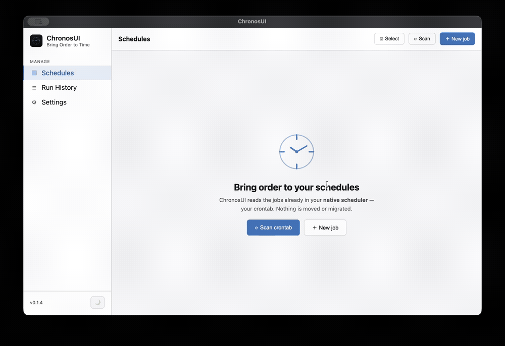
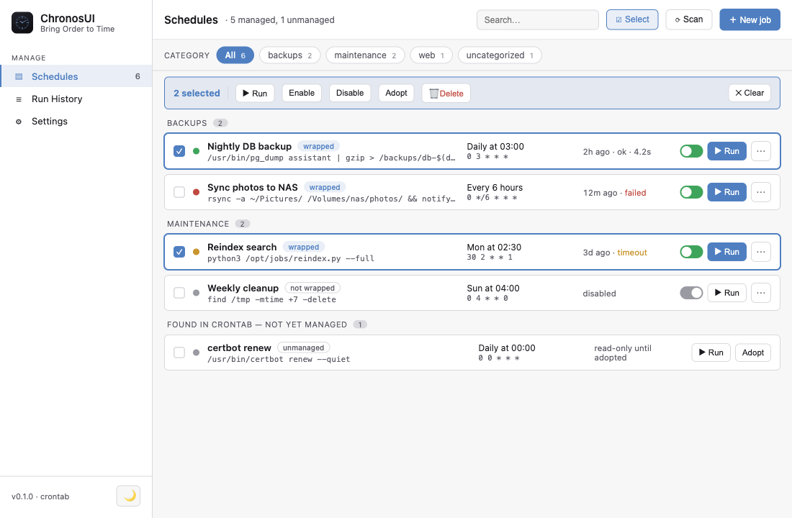

# ChronosUI

> **Bring observability to native schedulers.**

English | [繁體中文](./README.zh-TW.md)

[](https://github.com/AugustusW/chronos-ui/actions/workflows/ci.yml)
[](LICENSE)
[](https://github.com/AugustusW/chronos-ui/releases/latest)
[](https://github.com/AugustusW/chronos-ui/releases/latest)

A desktop control center for the schedulers you already use — **crontab** (macOS/Linux) and
**Windows Task Scheduler**. No daemon. No lock-in. No migration. ChronosUI doesn't replace cron,
launchd, or Task Scheduler; it makes them **observable** — run history, captured output,
durations, and on-demand runs.

> You already have a scheduler. What you're missing is visibility.

<p align="center">
  
  <br>
  <sub><a href="assets/hero.mp4">▶ Watch in higher quality (MP4)</a></sub>
</p>

## Download

👉 **Download the latest release: https://github.com/AugustusW/chronos-ui/releases/latest**

- **macOS** — `.dmg` (signed + notarized; Apple Silicon)
- **Windows** — `.exe` installer (NSIS). Currently unsigned, so on first run click
  *More info → Run anyway* past SmartScreen.

Or [build from source](#develop).

## Why?

Every developer eventually accumulates automation: daily backups, AI agents, scrapers, device
sync, data collectors, log cleanup. It all ends up in cron. Months later you SSH into a machine,
open `crontab -e`, and wonder *"which job is this, and is it even still working?"*

ChronosUI exists because managing automation through SSH, logs, and `crontab` is a bad workflow —
not because the schedulers are bad. They work fine. They just have no UI.

```text
Without ChronosUI                 With ChronosUI
─────────────────                 ──────────────
ssh into the box                  open the app
crontab -e                        see every job, its last run + output
grep, tail -f, guess              run any job on demand
vim, repeat                       read the run history
"…which job is this?"             done
```

## Features

- ✓ Discover the cron / Task Scheduler jobs you already have
- ✓ Adopt them without migration (no new daemon, fully reversible)
- ✓ Run any job on demand
- ✓ Run history with captured stdout/stderr and durations
- ✓ Telegram notifications when a scheduled job fails or times out (immediate, or batched into a digest)
- ✓ SQLite by default, PostgreSQL optional
- ✓ Cross-platform (macOS, Windows; Linux via cron)

## Screenshot

<p align="center">
  
</p>

## How it works

ChronosUI reads your native scheduler and shows it in a clean GUI. To record the output of
*scheduled* runs, it can "adopt" a job by wrapping its command with a small bundled binary
(`schedmgr`) — fully transparent (same working directory, environment, and exit code) and
one-click reversible. The exact `crontab` rewrite is documented in [docs/crontab.md](docs/crontab.md).

## macOS permissions

### Why does macOS ask for admin-like permission?

The first time you **adopt or edit a cron job**, macOS shows *"ChronosUI wants to administer this computer…"*. This is **not** dangerous — it's macOS's generic prompt for any app that touches crontab (cron files live in the protected `/var/at/tabs/` location). ChronosUI only runs `crontab -l` / `crontab -`; it never modifies passwords, network, or system settings. Click **Allow** once.

Batched Telegram notifications don't trigger it (they use a per-user LaunchAgent in your home directory). If you clicked **Don't Allow** by mistake, reset it from a terminal and relaunch:

```bash
tccutil reset All com.augustusw.chronos-ui
```

## Develop

```bash
git clone https://github.com/AugustusW/chronos-ui.git
cd chronos-ui
npm install
npm run dev      # launch the app
npm test         # unit tests
npm run lint     # lint
npm run build    # production build
```

Requires Node 20+. Releasing is documented in [RELEASING.md](./RELEASING.md).

## Status

Early but usable. Core scheduling discovery, adoption, run history, and packaging are working. The
UI and integrations are still evolving. Issues and PRs welcome.

## License

Apache-2.0. See [LICENSE](./LICENSE) and [NOTICE](./NOTICE). Contributions require a DCO sign-off
(`git commit -s`); see [CONTRIBUTING](./CONTRIBUTING.md).

---

> You don't need another scheduler. You need to understand the one you already have.
